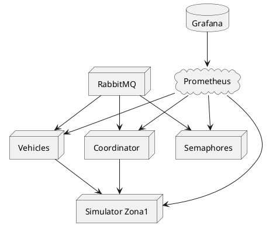

# Simulación de Tráfico Distribuida en Tiempo Real

Bienvenido al **motor de simulación de tráfico distribuido**, que implementa:

* Segmentación en zonas (nodos) con microservicios.
* Migración y sincronización de vehículos.
* Monitorización en tiempo real con Prometheus y Grafana.

---

## Índice

1. [Requisitos](#requisitos)
2. [Instalación](#instalación)
3. [Comandos Útiles](#comandos-útiles)
4. [Arquitectura y Diagrama](#arquitectura-y-diagrama)
5. [Flujo de Mensajes](#flujo-de-mensajes)
6. [Despliegue con Docker Compose](#despliegue-con-docker-compose)
7. [Escalado Multi-Nodo](#escalado-multi-nodo)
8. [Visualización en Grafana](#visualización-en-grafana)
9. [Kubernetes (Opcional)](#kubernetes-opcional)

---

## Requisitos

Antes de comenzar, asegúrate de tener instalado en tu máquina:

* **Docker**

  * **Windows/Mac**: descarga e instala **Docker Desktop** desde [https://www.docker.com/get-started](https://www.docker.com/get-started).
  * **Linux (Ubuntu/Debian)**:

    ```bash
    sudo apt update
    sudo apt install ca-certificates curl gnupg lsb-release -y
    curl -fsSL https://download.docker.com/linux/ubuntu/gpg | sudo gpg --dearmor -o /usr/share/keyrings/docker-archive-keyring.gpg
    echo \"deb [arch=$(dpkg --print-architecture) signed-by=/usr/share/keyrings/docker-archive-keyring.gpg] https://download.docker.com/linux/ubuntu $(lsb_release -cs) stable\" \
      | sudo tee /etc/apt/sources.list.d/docker.list > /dev/null
    sudo apt update
    sudo apt install docker-ce docker-ce-cli containerd.io -y
    sudo usermod -aG docker $USER
    ```
  * **Verifica** que Docker esté corriendo:

    ```bash
    docker version
    ```
* **Docker Compose v2** (incluido en Docker Desktop o disponible como plugin):

  ```bash
  docker compose version
  ```
* **Python 3.10+** y **pip**:

  ```bash
  python3 --version
  pip --version
  ```
* **Dependencias de Python** (para tests y scripts auxiliares):

  ```bash
  pip install locust requests prometheus_client fastapi uvicorn aio-pika tenacity
  ```

---

\$1

## Estructura del Proyecto

```bash
project-root/
├── docker-compose.yml
├── Dockerfile.simulator
├── monitoring/
│   └── prometheus.yml
├── services/
│   ├── coordinator_service/
│   │   ├── Dockerfile
│   │   ├── requirements.txt
│   │   └── main.py
│   ├── vehicles_service/
│   │   ├── Dockerfile
│   │   ├── requirements.txt
│   │   └── main.py
│   └── semaphores_service/
│       ├── Dockerfile
│       ├── requirements.txt
│       └── main.py
├── simulation/
│   ├── __init__.py
│   ├── city.py
│   └── simulator.py
├── docs/
│   └── images/
│       ├── Code_X5WhrLWeSc.png
│       ├── Code_MRIq698y1l.png
│       ├── Code_wxHcFYIGqJ.png
│       └── Code_1ZeevybiLP.png
├── locustfile.py
├── resilience_test.py
├── README.md
├── DOCUMENTACION_FASE7.md
└── RESULTADOS_PRUEBAS.md
```

\$2

### Levantar todo el stack

```bash
docker compose up --build -d  
```

Verifica estado:

```bash
docker compose ps  
```

### Acceder a servicios

* Coordinator API:        `http://localhost:5000/health`
* Vehicles API:           `http://localhost:5001/health`
* Semaphores API:         `http://localhost:5002/health`
* Simulator Zona1 metrics: `http://localhost:8003/metrics`
* RabbitMQ UI:            `http://localhost:15672` (guest/guest)
* Prometheus UI:          `http://localhost:9090`
* Grafana UI:             `http://localhost:3000` (admin/changeme)

### Reiniciar un contenedor

```bash
docker compose restart simulator-zona1  
# o any service name  
```

### Pruebas de carga con Locust

```bash
locust -f locustfile.py  
# UI en http://localhost:8089  
```

### Prueba de resiliencia

```bash
python resilience_test.py  
```

---

## Arquitectura y Diagrama

El sistema se compone de:

* **RabbitMQ** como broker AMQP.
* **Coordinator Service** (FastAPI) para balanceo de carga.
* **Vehicles Service** y **Semaphores Service** (FastAPI) para lógica de tráfico.
* **Simulator Nodes** por zona (e.g., `simulator-zona1`).
* **Prometheus** para recopilación de métricas.
* **Grafana** para dashboards.

### Diagrama de Despliegue



---

## Flujo de Mensajes

1. **Reporte de carga**: Cada nodo envía `/report_load` al Coordinator con su número de vehículos.
2. **Asignación**: Coordinator responde con la zona menos cargada para nuevas migraciones.
3. **Migración**: Vehicles Service publica en RabbitMQ el mensaje, y el nodo destino lo consume.

---

## Despliegue con Docker Compose

### Pasos de Arranque

```bash
docker compose up --build -d  
docker compose ps  
```


---

## Escalado Multi-Nodo

Para añadir otra zona (`zona2`):

1. Copia el bloque de `simulator-zona1` en `docker-compose.yml`:

   ```yaml
   simulator-zona2:
     build:
       context: .
       dockerfile: Dockerfile.simulator
     container_name: simulator-zona2
     command: ["python", "simulation/simulator.py", "--zone", "zona2"]
     ports:
       - "8004:8001"
     depends_on: [rabbitmq]
   ```
2. Añade en `monitoring/prometheus.yml`:

   ```yaml
   - job_name: 'sim_zona2'
     static_configs:
       - targets: ['simulator-zona2:8001']
   ```
3. Levanta:

   ```bash
   ```

docker compose up -d simulator-zona2

````

---

## Visualización en Grafana

1. Accede a `http://localhost:3000` (admin/changeme).
2. Configura Prometheus (`http://prometheus:9090`) como fuente de datos.
3. Crea paneles con PromQL:
   - **Carga**: `node_load` 
   - **Migraciones**: `rate(migrations_out_total[1m])` 
   - **Latencia**: `histogram_quantile(0.5, sum(rate(message_latency_seconds_bucket[1m])) by (le, zone))` 

---

## Kubernetes (Opcional)

```yaml
apiVersion: apps/v1
kind: Deployment
metadata:
  name: vehicles-deployment
spec:
  replicas: 3
  template:
    metadata:
      labels: { app: vehicles }
    spec:
      containers:
      - name: vehicles
        image: tu-registry/vehicles:latest
        ports: [{ containerPort: 8000 }]
````

---

## Contribuciones y Mejoras

* Implementar algoritmo de consenso (Raft).
* Orquestación con Helm Charts.
* Pruebas de carga continuas en CI/CD.
* Alertas y notificaciones basadas en métricas.

---

*Fin de la guía de despliegue y documentación.*
